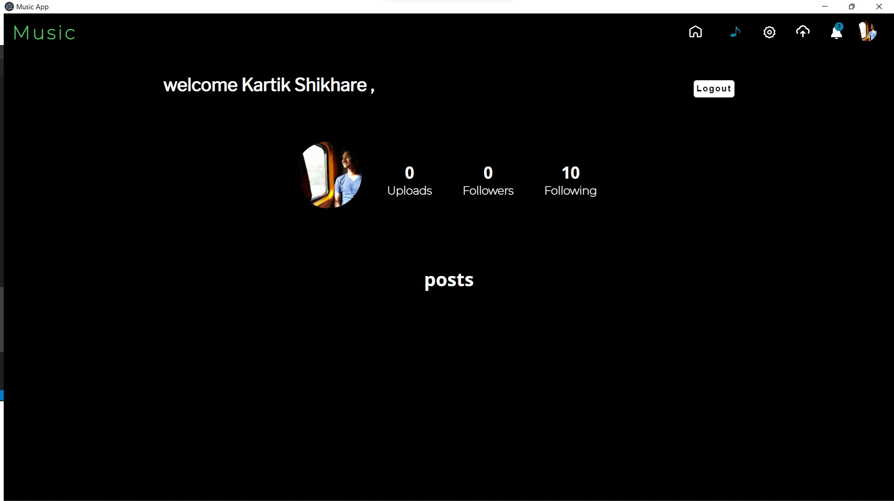
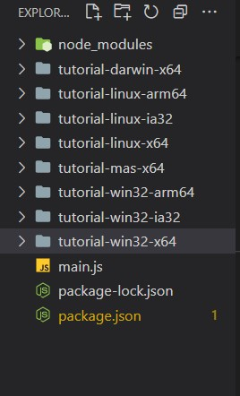

# Convert Url To Desktop App With Electron

## Perquisites

- node JS - [install](https://nodejs.org/en/download/)

> ## Step-1

### Create Folder And in Terminal Run This Commands

```cmd
npm init
```

just hit enter unless you end up .

### copy paste this to package.json and change your "name" , "description" , "author" if you want

```json
{
	"name": "tutorial",
	"version": "1.0.0",
	"description": "",
	"main": "main.js",
	"scripts": {
		"start": "electron ."
	},
	"author": "",
	"license": "ISC"
}
```

> #### Note : Your package.json must have

```
"scripts": {

    	"start": "electron ."
    },
```

> ### now file structure should be

```

tutorial
|package.json

```

> ## Step-2

### Run This Command

```cmd
npm install --save-dev electron
```

#### it will create package.json file and it will add this electron dependency to package.json file

```json
{
	"name": "tutorial",
	"version": "1.0.0",
	"description": "",
	"main": "main.js",
	"scripts": {
		"start": "electron ."
	},
	"author": "",
	"license": "ISC",
	"devDependencies": {
		"electron": "^16.0.1"
	}
}
```

### now file structure should be

```

tutorial
        |node modules
            |(All Node Modules)
        |package.json
        |package-lock.json

```

> ##### ignore if there is no package-lock.json

---

> ## Step-3

Now create a file named main.js and paste this code in it

```js
const { app, BrowserWindow, nativeTheme } = require("electron");
const path = require("path");

function createWindow() {
	const win = new BrowserWindow({
		title: "Tutorial",
		center: true,
		// You Can Set Custom Height and Width
		// width:800,
		// height:600,
		show: false,
		title: "Tutorial",
		titleBarOverlay: {
			color: "#0000",
			opacity: 0.5,
		},
		// Only If you Want to add Icons
		// _______________________________
		// icon: path.join(__dirname, Icon Path / Icon),
		//_______________________________
		webPreferences: {
			preload: path.join(__dirname, "preload.js"),
		},
	});
	// Here You Have To Put Your Website Link inside the quotes
	// _______________________________________________
	win.loadURL("https://musicapp-kohl.vercel.app/");
	// _______________________________________________
	win.setMenu(null);
	// To keep it in small window comment next line
	win.maximize();
	win.show();
}

app.whenReady().then(() => {
	createWindow();

	app.on("activate", () => {
		if (BrowserWindow.getAllWindows().length === 0) {
			createWindow();
		}
	});
});

app.on("window-all-closed", () => {
	if (process.platform !== "darwin") {
		app.quit();
	}
});
```

> ## To Add Your Own Link To The App Just Replace The Link In

```js
// From -
win.loadURL("https://musicapp-kohl.vercel.app/");
// To -
win.loadURL("Your Link Here");
```

### now file structure should be

```

tutorial
        |node modules
            |(All Node Modules)
        |package.json
        |package-lock.json
        |main.js

```

> ## Step-4

Now run this

```cmd
npm run
```

on ideal condition it will open new window in full screen mode with close button and all other buttons

> ##### Like This
>
> 

> ## Step-5

Now We Need to bundle this package into some exe and platform based
Thats why we need to install electron-packager

```cmd
npm install electron-packager
```

it will install electron globally into your system

> ## Step-6

Now we will be shifting to cmd and not in powershell strictly

- For All Platforms Generation

```cmd
electron-packager . <APP Name You Want To Give> --all --asar
```

- For Linux Generation

```cmd
electron-packager . <APP Name You Want To Give> --platform=linux
```

- For Windows Generation

```cmd
electron-packager . <APP Name You Want To Give> --platform=win32 --asar
```

- For Mac-Os Generation

```cmd
electron-packager . <APP Name You Want To Give> --platform=darwin
```

##### This might give Error due to some package If i find any solution i will update this

---

---

> ### Now You Will Have Packages Like this
>
> #### and you can find applications in this respective folders
>
> 

> ## By This You Have Completed The Tutorial And You have all the folders with all platforms

[getting started official Guide](https://www.electronjs.org/docs/latest/tutorial/quick-start)

[Video Reference for generation](https://youtu.be/aNJDdCjdDpU)

[Icon Change](https://stackoverflow.com/questions/31529772/how-to-set-app-icon-for-electron-atom-shell-app)

Contact Me At kartikshikhare26@gmail.com For Any Query
